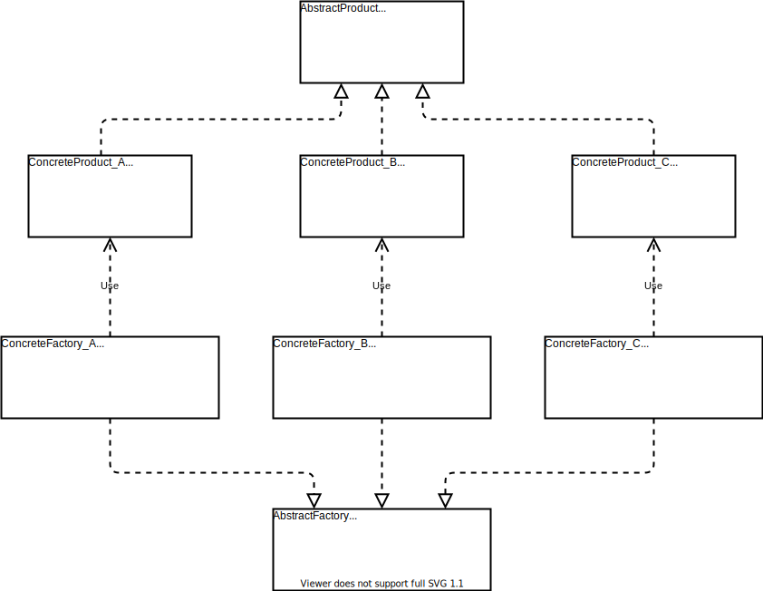
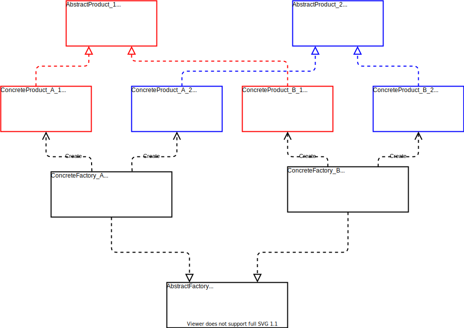

- [1. **简单工厂模式**](#1-简单工厂模式)
  - [1.1 **简单工厂模式的定义**](#11-简单工厂模式的定义)
  - [1.2 **简单工厂模式的使用目的**](#12-简单工厂模式的使用目的)
  - [1.3 **简单工厂模式的实现方案**](#13-简单工厂模式的实现方案)
  - [1.4 **简单工厂模式的特点**](#14-简单工厂模式的特点)
- [2. **工厂方法模式**](#2-工厂方法模式)
  - [2.1 **工厂方法模式的定义**](#21-工厂方法模式的定义)
  - [2.2 **工厂方法模式的使用目的**](#22-工厂方法模式的使用目的)
  - [2.3 **工厂方法模式的实现方案**](#23-工厂方法模式的实现方案)
  - [2.4 **工厂方法模式的特点**](#24-工厂方法模式的特点)
    - [1) 优点](#1-优点)
    - [2) 缺点](#2-缺点)
    - [3) 适用场景](#3-适用场景)
- [3. **抽象工厂模式**](#3-抽象工厂模式)
  - [3.1 **抽象工厂模式的定义**](#31-抽象工厂模式的定义)
  - [3.2 **抽象工厂模式的使用目的**](#32-抽象工厂模式的使用目的)
  - [3.3 **抽象工厂模式的实现方案**](#33-抽象工厂模式的实现方案)
  - [3.4 抽象工厂模式的特点](#34-抽象工厂模式的特点)
    - [1) 优点](#1-优点-1)
    - [2) 缺点](#2-缺点-1)
    - [3) 适用场景](#3-适用场景-1)
- [4. **Apollo中的工厂模式**](#4-apollo中的工厂模式)
  
工厂模式中包含:
- 简单工厂模式
- 工厂方法模式
- 抽象工厂模式  
  
这三种模式,依次升级,简单工厂模式是工厂方法模式的基础,工厂方法模式又是抽象工厂模式的基础.

## 1. **简单工厂模式**

### 1.1 **简单工厂模式的定义**
> 定义一个工厂类,它根据不同的输入参数返回不同类的实例对象,被创建的这些实例通常拥有共同的父类,
### 1.2 **简单工厂模式的使用目的**
有时候用户不需要知道或者无法知道某个类的实例对象的创建过程,这个时候就将创建该实例的功能封装到一个工厂类中,用户通过向工厂类中传入相应的参数,就能获取到该参数对应的实例对象.

从设计原则上将,这也是对**职责单一原则**的贯彻,即:通过工厂类,将某个类的实例化和该类的实例对象的使用进行了分离.
### 1.3 **简单工厂模式的实现方案**
简单工厂模式的UML图:  
<div align=center>


</div>
由上图可以看出,简单工厂模式的实现方案由三个要点:  

- **工厂(Factory)**:在`factoryMethod()`中实现创建所有具体产品实例的逻辑, 返回类型为抽象产品类型`Product`
- **抽象产品(Product)**:抽象产品中定义了所有具体产品共有的方法和属性.
- **具体产品(ConcreteProduct)**:每一个具体产品都继承自抽象产品,并实现了抽象产品中所生命的各种方法.

```C++
#include <iostream>
#include <string>

typedef enum {
  TRUCK,
  CAR

} VehicleType;

// 抽象产品类: 车辆
class Vehicle {
public:
  Vehicle(){};
  ~Vehicle(){};

public:
  virtual void Run() = 0;                      // 车辆的共有方法:跑
  int NumberOfWheels() { return num_wheels_; } // 车辆的共有方法: 获取轮子的个数

protected:
  int num_wheels_; // 车辆的共有属性:轮子的个数
};

// 具体产品类: 货车
class TruckVehicle : public Vehicle {
public:
  TruckVehicle() {
    std::cout << "this is a truck!" << std::endl;
    num_wheels_ = 6;
  };
  ~TruckVehicle(){};

public:
  void Run() override; // 实现抽象产品类中声明的方法
};

void TruckVehicle::Run() {
  std::cout << "货车拉着货物跑!" << std::endl;
  return;
}

// 具体产品类: 轿车
class CarVehicle : public Vehicle {
public:
  CarVehicle() {
    std::cout << "this is a car!" << std::endl;
    num_wheels_ = 4;
  };
  ~CarVehicle(){};

public:
  void Run() override; // 实现抽象产品类中声明的方法
};

void CarVehicle::Run() {
  std::cout << "轿车拉着人跑!" << std::endl;
  return;
}

// 工厂类
class VehicleFactory {
public:
  VehicleFactory(){};
  ~VehicleFactory(){};

public:
  Vehicle *GenerateVehicle(const VehicleType &vehicle_type);
};

Vehicle *VehicleFactory::GenerateVehicle(const VehicleType &vehicle_type) {
  Vehicle *vehicle_ptr = nullptr;
  switch (vehicle_type) {
  case TRUCK:
    vehicle_ptr = new TruckVehicle();
    break;
  case CAR:
    vehicle_ptr = new CarVehicle();
    break;
  default:
    std::cout << "this type: " << vehicle_type << " is not existed!";
    break;
  }
  return vehicle_ptr;
}

int main(int, char **) {
  auto factory = VehicleFactory();
  VehicleType type1 = TRUCK;
  auto vehicle1 = factory.GenerateVehicle(type1);
  vehicle1->Run();
  std::cout << "Number of Wheels is : " << vehicle1->NumberOfWheels()
            << std::endl;

  VehicleType type2 = CAR;
  auto vehicle2 = factory.GenerateVehicle(type2);
  vehicle2->Run();
  std::cout << "Number of Wheels is : " << vehicle2->NumberOfWheels()
            << std::endl;

  return 0;
}
```
输出为:
```
this is a truck!
货车拉着货物跑!
Number of Wheels is : 6
this is a car!
轿车拉着人跑!
Number of Wheels is : 4
```
简单工厂模式的实现主要是实现**工厂类**,**抽象产品类**和**具体产品类**.如上例中,`VehicleFactory`是工厂类,`Vehicle`是抽象产品类,`TruckVehicle`和`CarVehicle`都是具体的产品类.
### 1.4 **简单工厂模式的特点**
从上面的例子我们也可以看出:  
- 如果想要再增加一种类型的车辆:客车,那么除了新增一个`BusVehicle`类之外,还需要在`VehicleFactory`中再增加一个case条件.这显然违背了**对扩展开放,对修改关闭**的原则,因为修改了`VehicleFactory`中的代码.  
- 此外如果具体的产品类非常多的化,那么在工厂类中创建具体产品类的实例时,会有很多的分支,导致工厂类过于庞大.  
  
为了解决以上两个缺点,又引入了**工厂方法模式**.

## 2. **工厂方法模式**
### 2.1 **工厂方法模式的定义**
> 在抽象工厂类中定义一个用于创建产品类实例的接口,但是让抽象工厂类的子类去决定将哪个具体产品类实例化.这样就将一个具体产品类的实例化过程推迟到抽象工厂类的子类去实现
### 2.2 **工厂方法模式的使用目的**
在简单工厂模式中,每增加一个新的具体产品,都需要修改工厂类中的代码,这就违反了开闭原则.为了不用修改工厂类,遵循开闭原则,工厂方法模式中,不再通过工厂类创建所有的具体产品,而是针对不同的具体产品,设计不同的具体工厂,每一个具体工厂只生产一种具体产品.

### 2.3 **工厂方法模式的实现方案**
工厂方法模式的UML图:  
<div align=center>


</div>
从上图中可以看出,工厂方法模式中有四种角色:  

- **抽象工厂(AbstractFactory)**:定义了创建一个产品实例的接口,以及所用具体工厂的共有方法和属性,是所有具体工厂类的父类;
- **具体工厂(ConcreteFactory)**:实现了抽象工厂中定义的创建产品实例的借口;
- **抽象产品(AbstractProduct)**:是所有具体产品的父类,并且定义了所有产品的共有行为和属性
- **具体产品(ConcreteProduct)**:实现了抽闲产品中所定义的共有行为

```C++
#include <iostream>
#include <string>

// 抽象产品类: 车辆
class Vehicle {
public:
  Vehicle(){};
  ~Vehicle(){};

public:
  virtual void Run() = 0;                      // 车辆的共有方法:跑
  int NumberOfWheels() { return num_wheels_; } // 车辆的共有方法: 获取轮子的个数

protected:
  int num_wheels_; // 车辆的共有属性:轮子的个数
};

// 具体产品类: 货车
class TruckVehicle : public Vehicle {
public:
  TruckVehicle() {
    std::cout << "this is a truck!" << std::endl;
    num_wheels_ = 6;
  };
  ~TruckVehicle(){};

public:
  void Run() override; // 实现抽象产品类中声明的方法
};

void TruckVehicle::Run() {
  std::cout << "货车拉着货物跑!" << std::endl;
  return;
}

// 具体产品类: 轿车
class CarVehicle : public Vehicle {
public:
  CarVehicle() {
    std::cout << "this is a car!" << std::endl;
    num_wheels_ = 4;
  };
  ~CarVehicle(){};

public:
  void Run() override; // 实现抽象产品类中声明的方法
};

void CarVehicle::Run() {
  std::cout << "轿车拉着人跑!" << std::endl;
  return;
}

// 具体产品类: 客车
class BusVehicle : public Vehicle {
public:
  BusVehicle() {
    std::cout << "this is a bus!" << std::endl;
    num_wheels_ = 4;
  };
  ~BusVehicle(){};

public:
  void Run() override; // 实现抽象产品类中声明的方法
};

void BusVehicle::Run() {
  std::cout << "客车拉着乘客跑!" << std::endl;
  return;
}


// 抽象工厂类
class AbstractVehicleFactory {
public:
  AbstractVehicleFactory(){};
  ~AbstractVehicleFactory(){};

public:
  virtual Vehicle *GenerateVehicle() = 0; // 定义创建产品实例的接口
};

// 具体工厂类: 货车厂
class TruckVehicleFactory : public AbstractVehicleFactory
{
public:
  TruckVehicleFactory(){
    std::cout << "this is a truck factory!" << std::endl;
  };
  ~TruckVehicleFactory(){};
public:
  Vehicle* GenerateVehicle() override; // 实现创建产品实例的接口
};

Vehicle* TruckVehicleFactory::GenerateVehicle(){
  return new TruckVehicle();
}

// 具体工厂类: 轿车厂
class CarVehicleFactory : public AbstractVehicleFactory
{
public:
  CarVehicleFactory() {
    std::cout << "this is a car factory!" << std::endl;
  };
  ~CarVehicleFactory(){};
public:
  Vehicle* GenerateVehicle() override;// 实现创建产品实例的接口
};

Vehicle* CarVehicleFactory::GenerateVehicle(){
  return new CarVehicle();
}

// 具体工厂类: 客车厂
class BusVehicleFactory : public AbstractVehicleFactory
{
public:
  BusVehicleFactory() {
    std::cout << "this is a bus factory!" << std::endl;
  };
  ~BusVehicleFactory(){};
public:
  Vehicle* GenerateVehicle() override;// 实现创建产品实例的接口
};

Vehicle* BusVehicleFactory::GenerateVehicle(){
  return new BusVehicle();
} 

int main(int, char **) {
  AbstractVehicleFactory* factory = nullptr;
  Vehicle* vehicle = nullptr;


  factory = new TruckVehicleFactory();
  vehicle = factory->GenerateVehicle();
  vehicle->Run();
  std::cout << "Number of Wheels is : " << vehicle->NumberOfWheels()
            << std::endl;

  factory = new CarVehicleFactory();
  vehicle = factory->GenerateVehicle();
  vehicle->Run();
  std::cout << "Number of Wheels is : " << vehicle->NumberOfWheels()
            << std::endl;

  factory = new BusVehicleFactory();
  vehicle = factory->GenerateVehicle();
  vehicle->Run();
  std::cout << "Number of Wheels is : " << vehicle->NumberOfWheels()
            << std::endl;

  return 0;
}
```
输出为:
```
this is a truck factory!
this is a truck!
货车拉着货物跑!
Number of Wheels is : 6
this is a car factory!
this is a car!
轿车拉着人跑!
Number of Wheels is : 4
this is a bus factory!
this is a bus!
客车拉着乘客跑!
Number of Wheels is : 4
```
### 2.4 **工厂方法模式的特点**
#### 1) 优点
- 工厂方法模式解决了简单工厂模式中违反开闭原则的问题;
- 基于工厂角色和产品角色的多态性设计是工厂方法模式的关键。它能够让工厂可以自主确定创建何种产品对象，而如何创建这个对象的细节则完全封装在具体工厂内部
#### 2) 缺点
- 工厂方法模式中一旦增加一个新的产品,就需要增加一个对应该产品的工厂,因此类的个数是成对增加的;
- 工厂方法模式中在工厂层面和产品层面都引入了抽象层,使得整个结构变得复杂;

#### 3) 适用场景
- 客户不需要知道其锁需要的产品是哪个类的实例.比如上例中,客户不需要知道知道变量`vehicle`是`BusVehicle`,`TruckVehicle,`,`CarVehicle`中的哪个类的实例,只需要调用对应的工厂,就能得到想要的那一种产品;
- 抽象工厂类通过子类来实现对某个具体产品的实例化过程.
## 3. **抽象工厂模式**
### 3.1 **抽象工厂模式的定义**
抽象工厂模式是对简单工厂模式和工厂方法模式的进一步升级改进.在工厂方法模式中一个具体工厂只能生产一种具体产品,但是在实际中,一个具体工厂是能够生产几种相似的一类产品的.比如,轿车厂不会只生产完全一样的一种轿车,而是会生产所谓"至尊版","豪华版","舒适版","经济版"多种类型的轿车,但是这些不同版本的轿车是可以划归为一类产品的.  
抽象工厂模式相较于工厂方法模式的不同之处就在于:**抽象工厂模式中,一个具体的工厂可以生产不同类型的产品**.
### 3.2 **抽象工厂模式的使用目的**
为了使得一个具体工厂可以生产多种产品,避免每增加一个产品就增加一个具体工厂的问题.
### 3.3 **抽象工厂模式的实现方案**
和工厂方法模式一样,抽象工厂的实现也是分为四个层次:
- **抽象工厂(AbstractFactory)**
- **具体工厂(ConcreteFactory)**
- **抽象产品(AbstractProduct)**
- **具体产品(ConcreteProduct)**

其UML图如下:
<div align=center>


</div>
仍然以车辆和车辆工厂为例子:我们将轿车和货车都分为"高档"和"低档"两中类型,按照抽象工厂模式的代码如下:  

```C++
#include <iostream>
#include <string>

// 抽象产品类: 高档车辆
class HighVehicle {
public:
  HighVehicle(){
    std::cout << "this is High!" << std::endl;
  };
  ~HighVehicle(){};

public:
  virtual void Run() = 0;                      // 车辆的共有方法:跑
  int NumberOfWheels() { return num_wheels_; } // 车辆的共有方法: 获取轮子的个数
  bool IsHigh() {return high_;}

protected:
  int num_wheels_; // 车辆的共有属性:轮子的个数
  bool high_ = true;
};

// 抽象产品类: 低档车辆
class LowVehicle {
public:
  LowVehicle(){
    std::cout << "this is Low!" << std::endl;
  };
  ~LowVehicle(){};

public:
  virtual void Run() = 0;                      // 车辆的共有方法:跑
  int NumberOfWheels() { return num_wheels_; } // 车辆的共有方法: 获取轮子的个数
  bool IsHigh() {return high_;}

protected:
  int num_wheels_; // 车辆的共有属性:轮子的个数
  bool high_ = false;
};


// 具体产品类: 高档货车
class HighTruckVehicle : public HighVehicle {
public:
  HighTruckVehicle() {
    std::cout << "this is a high truck!" << std::endl;
    num_wheels_ = 6;
  };
  ~HighTruckVehicle(){};

public:
  void Run() override; // 实现抽象产品类中声明的方法
};

void HighTruckVehicle::Run() {
  std::cout << "高档货车拉着高级货物跑!" << std::endl;
  return;
}

// 具体产品类: 低档货车
class LowTruckVehicle : public LowVehicle {
public:
  LowTruckVehicle() {
    std::cout << "this is a low truck!" << std::endl;
    num_wheels_ = 6;
  };
  ~LowTruckVehicle(){};

public:
  void Run() override; // 实现抽象产品类中声明的方法
};

void LowTruckVehicle::Run() {
  std::cout << "低档货车拉着一般货物跑!" << std::endl;
  return;
}

// 具体产品类: 高档轿车
class HighCarVehicle : public HighVehicle {
public:
  HighCarVehicle() {
    std::cout << "this is a high car!" << std::endl;
    num_wheels_ = 4;
  };
  ~HighCarVehicle(){};

public:
  void Run() override; // 实现抽象产品类中声明的方法
};

void HighCarVehicle::Run() {
  std::cout << "高档轿车拉着老板跑!" << std::endl;
  return;
}

// 具体产品类: 低档轿车
class LowCarVehicle : public LowVehicle {
public:
  LowCarVehicle() {
    std::cout << "this is a low car!" << std::endl;
    num_wheels_ = 4;
  };
  ~LowCarVehicle(){};

public:
  void Run() override; // 实现抽象产品类中声明的方法
};

void LowCarVehicle::Run() {
  std::cout << "低档轿车拉着员工跑!" << std::endl;
  return;
}


// 抽象工厂类
class AbstractVehicleFactory {
public:
  AbstractVehicleFactory(){};
  ~AbstractVehicleFactory(){};

public:
  virtual HighVehicle *GenerateHighVehicle() = 0;
  virtual LowVehicle *GenerateLowVehicle() = 0; 
};

// 具体工厂类: 货车厂
class TruckVehicleFactory : public AbstractVehicleFactory
{
public:
  TruckVehicleFactory(){
    std::cout << "this is a truck factory!" << std::endl;
  };
  ~TruckVehicleFactory(){};
public:
  HighVehicle *GenerateHighVehicle() override; // 实现创建产品实例的接口
  LowVehicle *GenerateLowVehicle() override;
};

HighVehicle* TruckVehicleFactory::GenerateHighVehicle(){
  return new HighTruckVehicle();
}

LowVehicle* TruckVehicleFactory::GenerateLowVehicle(){
  return new LowTruckVehicle();
}

// 具体工厂类: 轿车厂
class CarVehicleFactory : public AbstractVehicleFactory
{
public:
  CarVehicleFactory() {
    std::cout << "this is a car factory!" << std::endl;
  };
  ~CarVehicleFactory(){};
public:
  HighVehicle *GenerateHighVehicle() override; // 实现创建产品实例的接口
  LowVehicle *GenerateLowVehicle() override;
};

HighVehicle* CarVehicleFactory::GenerateHighVehicle(){
  return new HighCarVehicle();
}

LowVehicle* CarVehicleFactory::GenerateLowVehicle(){
  return new LowCarVehicle();
}


int main(int, char **) {
  AbstractVehicleFactory* factory = nullptr;
  HighVehicle* high_vehicle = nullptr;
  LowVehicle* low_vehicle = nullptr;


  factory = new TruckVehicleFactory();
  high_vehicle = factory->GenerateHighVehicle();
  high_vehicle->Run();
  std::cout << "Number of Wheels is : " << high_vehicle->NumberOfWheels()
            << std::endl;
  if(high_vehicle->IsHigh()){
    std::cout << "High!" << std::endl;
  }
  else
  {
    std::cout << "Low!" << std::endl;
  }

  factory = new TruckVehicleFactory();
  low_vehicle = factory->GenerateLowVehicle();
  low_vehicle->Run();
  std::cout << "Number of Wheels is : " << low_vehicle->NumberOfWheels()
            << std::endl;
  if(low_vehicle->IsHigh()){
    std::cout << "High!" << std::endl;
  }
  else
  {
    std::cout << "Low!" << std::endl;
  }


  factory = new CarVehicleFactory();
  high_vehicle = factory->GenerateHighVehicle();
  high_vehicle->Run();
  std::cout << "Number of Wheels is : " << high_vehicle->NumberOfWheels()
            << std::endl;
  if(high_vehicle->IsHigh()){
    std::cout << "High!" << std::endl;
  }
  else
  {
    std::cout << "Low!" << std::endl;
  }


  factory = new CarVehicleFactory();
  low_vehicle = factory->GenerateLowVehicle();
  low_vehicle->Run();
  std::cout << "Number of Wheels is : " << low_vehicle->NumberOfWheels()
            << std::endl;
  if(low_vehicle->IsHigh()){
    std::cout << "High!" << std::endl;
  }
  else
  {
    std::cout << "Low!" << std::endl;
  }
  return 0;
}

```

输出如下:  

```
this is a truck factory!
this is High!
this is a high truck!
高档货车拉着高级货物跑!
Number of Wheels is : 6
High!
this is a truck factory!
this is Low!
this is a low truck!
低档货车拉着一般货物跑!
Number of Wheels is : 6
Low!
this is a car factory!
this is High!
this is a high car!
高档轿车拉着老板跑!
Number of Wheels is : 4
High!
this is a car factory!
this is Low!
this is a low car!
低档轿车拉着员工跑!
Number of Wheels is : 4
Low!
```
### 3.4 抽象工厂模式的特点
#### 1) 优点
- 抽象工厂模式中,当需要再增加一类新的产品时,不如增加高档客车和低档客车,不需要修改原有的代码,只需要加入一个具体工厂类:客车厂,和两个具体产品类:高档客车,低档客车.很好的符合了开闭原则.
- 在客户创建所需的产品实例时,产品实例的创建细节对客户是隐藏的,客户只需要关注所需产品对应的工厂即可.比如:客户需要高档轿车,那么就关注轿车工厂`CarVehicleFactory`就可以了.
#### 2) 缺点
- 对于已经存在的一类产品,如果要增加该类产品的种类,那么需要修改原有的代码.比如:现在需要增加中档车这个种类,那么就需要对工厂类进行修改,这不符合开闭原则.
#### 3) 适用场景
- 一系列/一族产品需要被同时使用时，适合使用抽象工厂模式;
- 产品结构稳定，设计完成之后不会向系统中新增或剔除某个产品.

## 4. **Apollo中的工厂模式**

