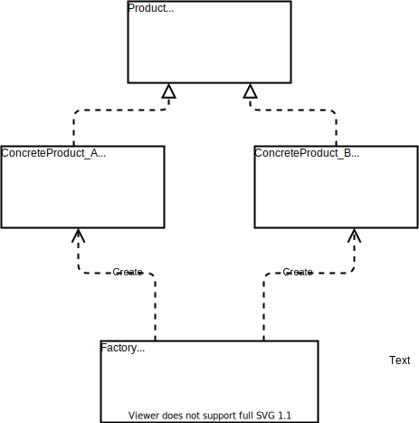

# **简单工厂模式**
工厂模式中包含:
- 简单工厂模式
- 工厂方法模式
- 抽象工厂模式  
  
这三种模式,依次升级,简单工厂模式是工厂方法模式的基础,工厂方法模式又是抽象工厂模式的基础.

<font face="黑体" color=red size=4>
这里首先学习的是简单工厂模式
</font>

## 1.1 **简单工厂模式的定义**
> 定义一个工厂类,它根据不同的输入参数返回不同类的实例对象,被创建的这些实例通常拥有共同的父类,
## 1.2 **简单工厂模式的使用目的**
有时候用户不需要知道或者无法知道某个类的实例对象的创建过程,这个时候就将创建该实例的功能封装到一个工厂类中,用户通过向工厂类中传入相应的参数,就能获取到该参数对应的实例对象.

从设计原则上将,这也是对**职责单一原则**的贯彻,即:通过工厂类,将某个类的实例化和该类的实例对象的使用进行了分离.
## 1.3 **简单工厂模式的实现方案**
简单工厂模式的UML图:  
<div align=center>


</div>
由上图可以看出,简单工厂模式的实现方案由三个要点:  

- **工厂(Factory)**:在`factoryMethod()`中实现创建所有具体产品实例的逻辑, 返回类型为抽象产品类型`Product`
- **抽象产品(Product)**:抽象产品中定义了所有具体产品共有的方法和属性.
- **具体产品(ConcreteProduct)**:每一个具体产品都继承自抽象产品,并实现了抽象产品中所生命的各种方法.

```C++
#include <iostream>
#include <string>

typedef enum {
  TRUCK,
  CAR

} VehicleType;

// 抽象产品类: 车辆
class Vehicle {
public:
  Vehicle(){};
  ~Vehicle(){};

public:
  virtual void Run() = 0;                      // 车辆的共有方法:跑
  int NumberOfWheels() { return num_wheels_; } // 车辆的共有方法: 获取轮子的个数

protected:
  int num_wheels_; // 车辆的共有属性:轮子的个数
};

// 具体产品类: 货车
class TruckVehicle : public Vehicle {
public:
  TruckVehicle() {
    std::cout << "this is a truck!" << std::endl;
    num_wheels_ = 6;
  };
  ~TruckVehicle(){};

public:
  void Run() override; // 实现抽象产品类中声明的方法
};

void TruckVehicle::Run() {
  std::cout << "货车拉着货物跑!" << std::endl;
  return;
}

// 具体产品类: 货车
class CarVehicle : public Vehicle {
public:
  CarVehicle() {
    std::cout << "this is a car!" << std::endl;
    num_wheels_ = 4;
  };
  ~CarVehicle(){};

public:
  void Run() override; // 实现抽象产品类中声明的方法
};

void CarVehicle::Run() {
  std::cout << "轿车拉着人跑!" << std::endl;
  return;
}

// 产品类
class VehicleFactory {
public:
  VehicleFactory(){};
  ~VehicleFactory(){};

public:
  Vehicle *GenerateVehicle(const VehicleType &vehicle_type);
};

Vehicle *VehicleFactory::GenerateVehicle(const VehicleType &vehicle_type) {
  Vehicle *vehicle_ptr = nullptr;
  switch (vehicle_type) {
  case TRUCK:
    vehicle_ptr = new TruckVehicle();
    break;
  case CAR:
    vehicle_ptr = new CarVehicle();
    break;
  default:
    std::cout << "this type: " << vehicle_type << " is not existed!";
    break;
  }
  return vehicle_ptr;
}

int main(int, char **) {
  auto factory = VehicleFactory();
  VehicleType type1 = TRUCK;
  auto vehicle1 = factory.GenerateVehicle(type1);
  vehicle1->Run();
  std::cout << "Number of Wheels is : " << vehicle1->NumberOfWheels()
            << std::endl;

  VehicleType type2 = CAR;
  auto vehicle2 = factory.GenerateVehicle(type2);
  vehicle2->Run();
  std::cout << "Number of Wheels is : " << vehicle2->NumberOfWheels()
            << std::endl;

  return 0;
}
```
输出为:
```
this is a truck!
货车拉着货物跑!
Number of Wheels is : 6
this is a car!
轿车拉着人跑!
Number of Wheels is : 4
```

